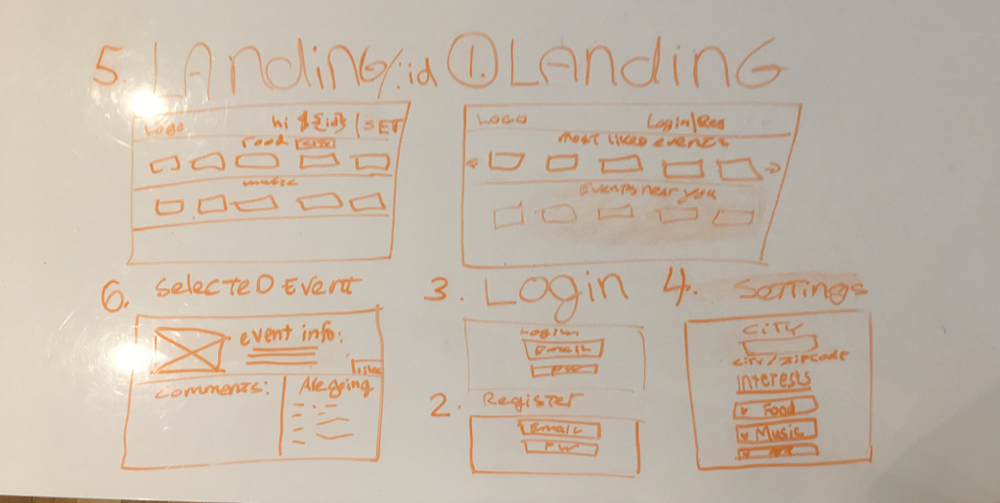
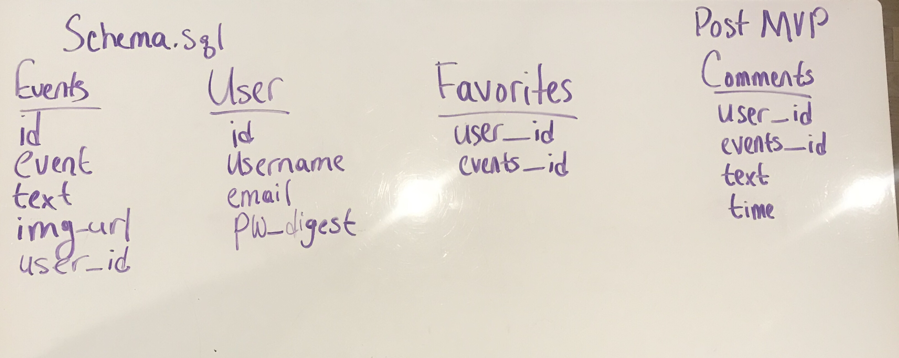

# H@ckUp

## Summary
Create a meetup inspired application for people in the tech community to meet, based on the
technologies that the user likes. The user can like, edit, delete and create events.
We used the mapbox.com API to show a map used for the location of the events.

## User Story
Initial Start
- User will be on the landing page of the Events Meetup. Popular events and events going on near the user will be page.

- A login and register will be to the top right corner. If they have not registered they will click on the register link and be guided to a register form. If otherwise they will be guided to a login form.

- The User will have a page for themselves, showing the events they will be attending and/or "liked".

- The user will be able to READ all the events they have chosen
- CREATE and event
- UPDATE and event they will possibly be going to or an event they created
- DELETE an event from their favorites list along with interests.

## Technologies
- Express
- PostGresSQL
- Models & Controllers
- CRUD
- REACT
- Mapbox API

## Installatin Instructions
- npm install on the root folder
- yarn install inside the client folder
- psql -f db/schema.psql
- psql -f db/seed.sql

## MVP
- API
- CRUD
- Auth
- Likes

## Post MVP
- Styling
- Search bar
- Comments
- Show the map with a marker pointing to the location of all the events

## Workflow
- setup - all together
- pst setup - pair programming, different pairs everyday and driver navigator switching periodically
- One pair will be doing Front-end the second pair will be doing Back-end
- Style guide: airBnb

## Wireframe

## ERD

## Time Management
| Component | Priority | Estimated Time | Time Invested | Actual Time |
| --- | :---: |  :---: | :---: | :---: |
| CRUD(Express/REACT) | H | 48hrs | N/A | 14hrs |
| Auth | H | 10hrs| 3 | 12hrs |
| Login/register/logout | H | 13hrs | 4.5hrs | 14hrs |
| API | H | 10hrs| 12 | 18hrs |
| Styling | L | 5hrs|  | 4hrs |
| Setup Server | H | 2hrs| 1.5hrs | 1.5hrs |
| event "likes" Functionality | m | |  | 10hrs |
|  |  | |  |  |
| Total |  | 75hrs |  | 73.5 |

## Obstacles
- Issues customizing the features of mapbox.com api  to make it fit our project goals

## code-snippet
